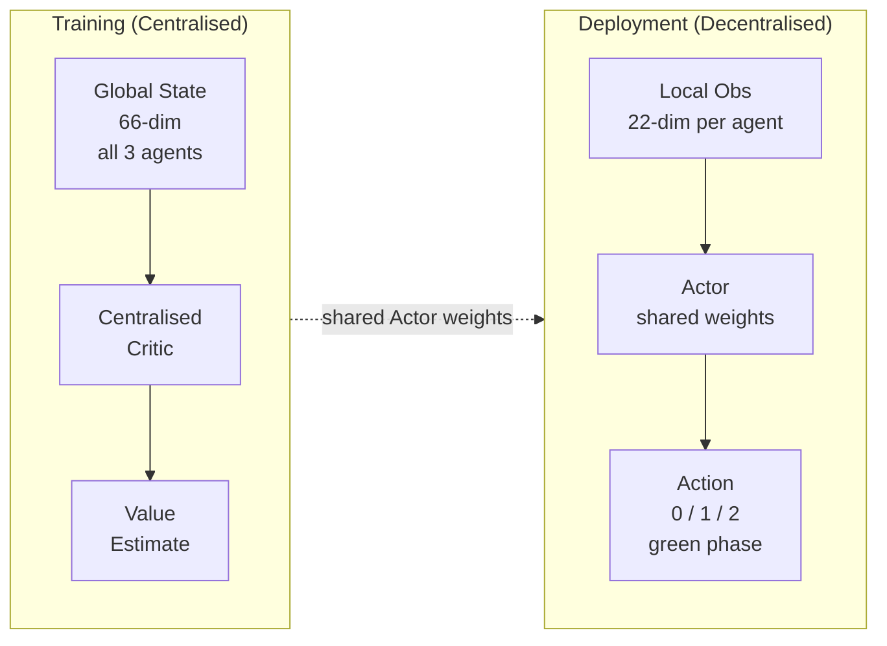

# PALMS - Multi-Agent Deep Reinforcement Learning Traffic Signal Control
### Palapye, Botswana · Triple Intersection Network

Three traffic lights. One cooperative policy. Trained with MAPPO to minimise waiting times across a real-world road layout.

---

## What This Is

PALMS trains a multi-agent reinforcement learning system to control the three signalised intersections along the A1 highway corridor through Palapye. Each traffic light is an independent agent that observes its own queue lengths and waiting times, then decides which green phase to hold or switch to. The agents share a single neural network (parameter sharing) and are trained cooperatively - they all benefit when the whole network flows well, not just one junction.

The algorithm is **MAPPO** (Multi-Agent Proximal Policy Optimisation) with a **Centralised Critic** - during training, the critic sees the full network state (all three intersections at once) to produce better value estimates, but at deployment each agent makes decisions using only its own local sensor data.

---

## Architecture



**Actor** - 22-dim local observation → 3 action logits (one per green phase)  
**CentralizedCritic** - 66-dim global state (all 3 agents concatenated) → scalar value  
**Parameter sharing** - one Actor network for all three traffic lights (they have the same structure, so the same "rules" apply to each)

---

## Local Observation (22 numbers per agent)

| Index | Feature | How it's measured |
|-------|---------|-------------------|
| 0–7 | Queue length per incoming lane | Halting vehicles, log-scaled |
| 8–15 | Waiting time per incoming lane | Cumulative wait, log-scaled |
| 16–19 | Vehicle count on outgoing lanes | Downstream congestion, log-scaled |
| 20 | Current green phase | Normalised 0–1 |
| 21 | Phase state | 0 = green, 1 = yellow |

---

## Project Structure

```
PALMS-Multi-Agent-Deep-Reinforcement-Learning-Traffic-Signal-Control-Palapye/
│
├── src/                          # All Python source (run scripts from the repo root)
│   ├── mappo_env.py              # Multi-agent SUMO environment (reset / step / reward)
│   ├── mappo_networks.py         # Actor + CentralizedCritic neural networks
│   ├── train_mappo.py            # Main training loop (rollout → GAE → PPO update)
│   │
│   ├── sumo_env.py               # Single-agent PPO environment (baseline)
│   ├── train_ppo.py              # Single-agent PPO training (baseline)
│   ├── dashboard.py              # Streamlit live monitor
│   │
│   ├── traffic_injector.py       # Dynamic vehicle injection by scenario
│   ├── traffic_scenario.py       # Demand scenario profiles (rush hour, holiday, etc.)
│   ├── green_wave.py             # Rule-based green-wave offset pre-computation
│   ├── tl_programs.py            # SUMO traffic light phase program loader
│   │
│   ├── evaluate_mappo.py         # Evaluate MAPPO vs fixed-time / baselines
│   ├── evaluate_network.py       # Network-wide evaluation across junctions
│   └── watch_mappo.py, demo_ctde.py, ...   # Live viewers & demos
│
├── Performance Analysis/         # Controller comparison scripts (run from repo root)
│   ├── mappo_vs_ppo_vs_fixed_network.py        # All 3 controllers, full network (bar charts)
│   ├── mappo_vs_ppo_vs_fixed_junction.py       # All 3 controllers at junction TL_A (bar charts)
│   ├── mappo_vs_ppo_vs_fixed_junction_live.py  # Same, per-step line graphs
│   ├── mappo_vs_fixed_network_live.py          # MAPPO vs Fixed, network time-series
│   └── ppo_vs_mappo_live_gui.py                # Live dual SUMO-GUI: SA-PPO vs MAPPO
│
├── network/                      # SUMO simulation files
│   ├── triple.sumocfg            # Simulation config entry point
│   ├── network_tripled.net.xml
│   ├── triple_routes_flows.rou.xml
│   ├── tls.add.xml               # Custom traffic light phase programs
│   └── vtypes.add.xml            # Vehicle type definitions
│
├── vehicle_detection/            # YOLOv8 vehicle detection (run from repo root)
│   ├── detect_traffic.py         # Runs YOLOv8 over traffic.mp4, counts/queues vehicles
│   ├── vehicle_detector.py       # Reusable detector class → MAPPO observation CSV
│   ├── traffic.mp4               # Source footage (gitignored - large)
│   ├── first_frame.jpg           # Calibration still (first frame of traffic.mp4)
│   └── yolov8n.pt, yolov8s.pt    # YOLO weights (gitignored - large)
│
├── tools/                        # Utilities (plotting, TLS editor, presentation gen)
├── animations/                   # Manim animations of the system
├── docs/                         # Project report (LaTeX) - see "Project Report" below
│   ├── main.tex, references.bib
│   ├── figures/                  # All report figures
│   └── presentations/            # Slide decks (.pptx)
│
├── mappo_models/                 # Saved checkpoints - best_/final_ tracked; numbered ones gitignored
├── mappo_logs/                   # CSV training log (gitignored)
├── output/                       # Generated evaluation plots/CSVs (gitignored)
├── SPPO_model/                   # Archive of the original single-agent PPO version
├── requirements.txt
└── README.md
```

> **Note on running scripts:** the Python modules use flat imports, so always run
> them **from the repository root** with the `src/` prefix, e.g.
> `python src/train_mappo.py`. This keeps both module imports and the relative
> data paths (`network/`, `mappo_models/`) resolving correctly.

---

## Setup

**Requirements:** Python 3.10+, SUMO 1.24+

```bash
# Create virtual environment
python -m venv rl_env
rl_env\Scripts\activate

# Install dependencies
pip install -r requirements.txt

# Set SUMO_HOME (Windows - adjust path if needed)
$env:SUMO_HOME = "C:\Program Files (x86)\Eclipse\Sumo"
```

---

## Training

```bash
python src/train_mappo.py
```

- **4 parallel SUMO environments** - diverse experience, faster data collection
- **1.5 million timesteps** - converges in ~3–4 hours on CPU
- **Curriculum learning** - starts on easy scenarios, adds rush hour and holiday as training progresses
- Saves `mappo_models/best_actor.pth` whenever evaluation reward improves
- Logs every update to `mappo_logs/mappo_train.csv` - open in Excel or plot with pandas

### Curriculum Schedule

| Episode count | Scenarios in pool |
|---|---|
| 0 – 29 | `low`, `normal` |
| 30 – 79 | `normal`, `rush_hour_am`, `rush_hour_pm`, `holiday` |
| 80+ | All scenarios (full random) |

### Training Output (example)

```
──────────────────────────────────────────────────────────────
  Progress  [████████░░░░░░░░░░░░░░░░░░░░░░░░░░░░░░░░]  20.0%
  Steps        300,000 / 1,500,000   ETA 02h 41m 03s
──────────────────────────────────────────────────────────────
  Metric                  Value
  ──────                  ─────
  Update                     73
  Mean Reward            -0.412
  Actor Loss             0.0183
  Critic Loss            0.2741
  Entropy                 1.073
  FPS                       104
──────────────────────────────────────────────────────────────
```

---

## Dashboard

```bash
python -m streamlit run src/dashboard.py
```

Live Streamlit interface showing:
- Real-time queue lengths and throughput per intersection
- Origin–destination flow heatmap
- Scenario selector and green wave toggle

---

## Evaluation

Run these from the **repository root** after training completes (or using the pre-trained checkpoints in `mappo_models/`).

### Single-intersection evaluation - MAPPO vs Fixed vs Random

```bash
python src/evaluate_mappo.py
```

Runs three controllers across all six traffic scenarios and records per-step metrics at every junction:

| Controller | Description |
|---|---|
| `mappo` | Trained policy (`mappo_models/best_actor.pth`), deterministic greedy |
| `fixed` | Fixed-time cycling - phases 0 → 1 → 2 → 0 every N steps |
| `random` | Uniform random phase selection (sanity baseline) |

**Output** (written to repo root and `output/`):
- `eval_summary.csv` - mean waiting time, queue length, throughput, stop ratio per controller per scenario
- `output/eval_comparison.png` - grouped bar chart across all scenarios

---

### Network-wide evaluation - MAPPO vs Fixed across all three junctions

```bash
python src/evaluate_network.py
```

Collects per-junction and network-wide metrics across all six demand scenarios.

**Output** (`output/`):
- `output/network_eval_summary.csv` - per-controller, per-scenario numbers for TL_A / TL_B / TL_C + network aggregate
- `output/network_eval_wait.png`, `network_eval_queue.png`, `network_eval_throughput.png`, `network_eval_pressure.png` - network-wide bar charts
- `output/network_eval_junctions_*.png` - per-junction breakdown

---

## Performance Analysis

All scripts in `Performance Analysis/` compare controllers head-to-head. Run them from the **repository root**:

### Bar-chart comparisons (static, all scenarios averaged)

```bash
# All 3 controllers - network-wide metrics
python "Performance Analysis/mappo_vs_ppo_vs_fixed_network.py"

# All 3 controllers - junction TL_A only
python "Performance Analysis/mappo_vs_ppo_vs_fixed_junction.py"
```

Compares **MAPPO**, **SA-PPO** (single-agent baseline from `SPPO_model/`), and **Fixed-time** on five metrics: waiting time, queue length, throughput, stop ratio, pressure.

**Output** (`output/`):
- `output/compare_summary.csv`, `output/compare_overall.png` - network-wide grouped bar charts
- `output/compare_tla_all_metrics.png` - TL_A junction bar chart

---

### Time-series comparisons (per-step line graphs)

```bash
# Line graphs at junction TL_A - MAPPO vs SA-PPO vs Fixed
python "Performance Analysis/mappo_vs_ppo_vs_fixed_junction_live.py"

# Line graphs across the full network - MAPPO vs Fixed
python "Performance Analysis/mappo_vs_fixed_network_live.py"
```

Records metrics at every simulation step and plots them as growing line charts (one line per controller).

**Output** (`output/`):
- `output/compare_tla_live.png` - per-step TL_A comparison
- `output/compare_network_waiting_time.png`, `compare_network_queue_length.png`, `compare_network_throughput.png`, `compare_network_stop_ratio.png`, `compare_network_pressure.png`

---

### Live dual-GUI comparison

```bash
# Opens two SUMO-GUI windows simultaneously: SA-PPO (left) vs MAPPO (right)
python "Performance Analysis/ppo_vs_mappo_live_gui.py"
```

Launches both simulations side by side and plots five metrics in real time as both step. Requires a display. Close the matplotlib window to stop both simulations cleanly.

---

### Metrics reference

| Metric | Definition |
|---|---|
| **Waiting time** | Mean seconds a vehicle spends stationary per incoming lane |
| **Queue length** | Mean halting vehicles per incoming lane |
| **Throughput** | Total vehicles that cleared the junction per episode |
| **Stop ratio** | Fraction of incoming vehicles stopped each step (mean) |
| **Pressure** | Mean (incoming vehicles − outgoing vehicles) per step |

---

## RL Design

| Component | Detail |
|---|---|
| **Algorithm** | MAPPO - Multi-Agent PPO with Centralised Critic |
| **Agents** | 3 (one per traffic light), parameter sharing |
| **Observation** | 22-dim local per agent; 66-dim global for critic |
| **Action** | Discrete(3) per agent - select green phase 0, 1, or 2 |
| **Reward** | Shared: `−tanh(avg_wait / 60s) − 0.1 × queue_ratio − collision/teleport penalties` |
| **Episode length** | 500 RL steps × 3 sim-seconds = 25 simulated minutes |
| **Min green hold** | 5 steps (15 sim-seconds) before a phase switch is allowed |
| **Advantage** | GAE (λ=0.95, γ=0.99) |
| **PPO clip** | ε = 0.2 |
| **Parallel envs** | 4 |

---

## Traffic Scenarios

| Scenario | Description | Direction bias |
|---|---|---|
| `low` | Off-peak, sparse traffic | Mixed |
| `normal` | Weekday mixed flow | Mixed |
| `rush_hour_am` | Heavy inbound morning commute | Inbound |
| `rush_hour_pm` | Heavy outbound evening commute | Outbound |
| `holiday` | Transit traffic through town | Transit |
| `incident` | Two entry edges blocked | Mixed |

---

## Results (single-agent PPO baseline → MAPPO)

The single-agent baseline (archived in [`SPPO_model/`](SPPO_model/), Stable Baselines3) treated all three traffic lights as one combined action space. MAPPO separates them into cooperating agents with a shared policy and a centralised critic, improving coordination at the cost of a more complex training setup.

Training logs are saved to `mappo_logs/mappo_train.csv`. Plot mean reward over timesteps to track convergence.

---

## Project Report

The full final year project report (LaTeX source) is in [`docs/`](docs/).

| File | Description |
|------|-------------|
| [`docs/main.tex`](docs/main.tex) | Main report document |
| [`docs/Simulation Report.tex`](docs/Simulation%20Report.tex) | Simulation analysis chapter |
| [`docs/references.bib`](docs/references.bib) | Bibliography |
| [`docs/figures/`](docs/figures/) | All report figures (resolved via `\graphicspath`) |
| [`docs/presentations/`](docs/presentations/) | Slide decks (.pptx) |

To compile locally: open `docs/main.tex` in [Overleaf](https://overleaf.com) (File → Upload Project → zip) or compile with `pdflatex` + `bibtex`.

---

## Tech Stack

- **SUMO 1.24+** - microscopic traffic simulation
- **TraCI** - Python API for real-time SUMO control
- **PyTorch** - neural networks and PPO optimisation
- **Streamlit + Plotly** - live training dashboard
- **NumPy / Gymnasium** - environment interface and rollout buffer
